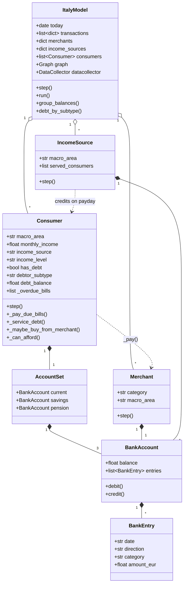
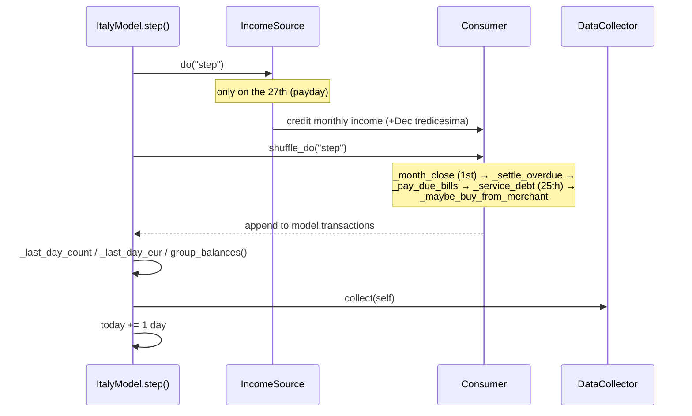
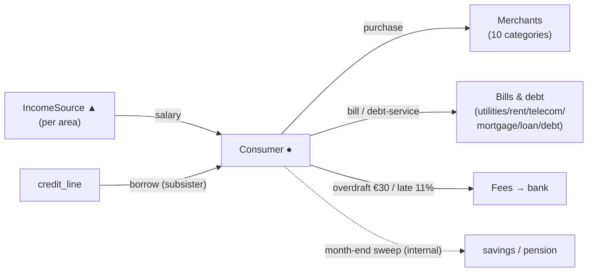

# Walkthrough — how the code runs, deterministically, end to end

This is the **mechanical** companion to the other docs. It starts at *where the code is
wired to run*, walks the execution **in order** (construction → one day → the whole run),
says **where every piece of data is stored**, summarises each module, and draws the
structure as **UML**. Every claim is anchored to real source with a `file:line` caption
above the quoted snippet.

It deliberately does **not** re-argue *why* (see [`EXPLANATION.md`](EXPLANATION.md)),
re-table the numbers (see [`MODEL_REFERENCE.md`](MODEL_REFERENCE.md)), restate the formal
spec (see [`ODD.md`](ODD.md)), repeat the plain-English file tour (see
[`HOW_IT_WORKS.md`](HOW_IT_WORKS.md)), or list run commands (see
[`QUICKSTART.md`](QUICKSTART.md)). For the fee / debtor-archetype deep-dive see
[`../debugging/debugging_answers1.md`](../debugging/debugging_answers1.md).

**The bank-eye framing.** The model emits only what a bank would see on its retail
customers' accounts — salary in, bills out, purchases at merchants, the bank's own fees.
Everything below serves that one output: the transaction log.

---

## 1. The three entry points — where the code is wired to run

There is **no CLI and no `[project.scripts]`** in the package; `import synthitaly` resolves
to `src/synthitaly` via setuptools (`pyproject.toml`). All three ways to drive the model
funnel through the single public class `ItalyModel`, re-exported by the package init:

> `src/synthitaly/__init__.py:19-21`
> ```python
> from .model import Consumer, IncomeSource, ItalyModel, Merchant
>
> __all__ = ["ItalyModel", "Consumer", "Merchant", "IncomeSource"]
> ```

| Entry point | Command | What it does |
|---|---|---|
| **Notebook / library** | `uv run jupyter lab notebooks/demo.ipynb` | `ItalyModel(...).run()` then `pd.DataFrame(model.transactions)` |
| **Solara dashboard** | `uv run solara run src/synthitaly/viz.py` | `viz.py` *is* the app; renders 11 live panels |
| **Sensitivity sweep** | `uv run python scripts/sweep_behavioural.py` | mutates `numbers.*` one knob at a time, re-runs, prints KPI tables |

**a) Notebook / library.** The canonical call path, documented in the package docstring:

> `src/synthitaly/__init__.py:4-12`
> ```python
>     from synthitaly import ItalyModel
>     model = ItalyModel(n_consumers=200, n_days=30, seed=42)
>     model.run()
>
>     import pandas as pd
>     df = pd.DataFrame(model.transactions)
>     print(df.head())
> ```

`notebooks/demo.ipynb` does exactly this (cell 2), then `df.to_csv("demo_transactions.csv")`
at the end — the only place anything touches disk.

**b) Solara dashboard.** `viz.py` has no `if __name__ == "__main__"` and no `Page`
function. Instead `solara run` loads the module and renders the module-level `page` object.
The model is built **once at import** (side-effect-free, so the server's health check passes):

> `src/synthitaly/viz.py:1065-1078`
> ```python
> model = ItalyModel(n_consumers=150, n_merchants_per_category=3, n_days=30, seed=42)
>
> page = SolaraViz(
>     model,
>     components=[
>         SpendingByArea, NetworkPanel, KPIPanel, BehaviouralEventsPanel,
>         IncomeCompositionPanel, BalanceTrajectoryPanel,
>         DebtorCompositionPanel, DebtTrajectoryPanel, ChronicDebtorPanel,
>         AccountInspectorPanel, ArchetypesPanel,
>     ],
>     model_params=model_params,
>     name="SynthItaly — bank-eye view",
> )
> page  # noqa: B018 (solara reads this at module load)
> ```

The sliders that let the user rebuild the model live in `model_params`:

> `src/synthitaly/viz.py:91-98`
> ```python
> model_params = {
>     "seed": Slider("Random seed", value=42, min=1, max=9999, step=1),
>     "n_consumers": Slider("Consumers", value=150, min=50, max=500, step=10),
>     "n_merchants_per_category": Slider(...),
>     "n_days": Slider("Days to run", value=30, min=5, max=60, step=1),
> }
> ```

**c) Sweep.** A plain `main()` (no argparse) that, for each behavioural constant, assigns a
test value onto the `numbers` module, constructs and runs a model, reads KPIs off
`m.transactions` / `m.consumers`, then restores the defaults:

> `scripts/sweep_behavioural.py:47` (short horizon) and `:92` (long horizon for debt)
> ```python
> m = ItalyModel(n_consumers=N_CONSUMERS, n_days=N_DAYS, seed=SEED)
> ```
> `scripts/sweep_behavioural.py:182-183`
> ```python
> if __name__ == "__main__":
>     main()
> ```

---

## 2. Module summaries

The live package is three files under `src/synthitaly/` (plus the 22-line `__init__.py`).

### `numbers.py` — the single source of empirical truth

> `src/synthitaly/numbers.py:4-7`
> ```python
> This file is the *only* place where empirical constants from the source papers
> live. The model in ``model.py`` reads them; the notebook reads them; the
> Solara app reads them. Nothing is computed here — these are values you can
> trace back to a paper PDF in ``italy_papers/``.
> ```

Three layers: **constants** (e.g. `MACRO_AREA_WEIGHTS`, `CATEGORY_SHARES`, `BILL_TYPES`,
`INCOME_SOURCE_RELATIVE/SHARE/SIGMA`, the behavioural block `OVERDRAFT_FEE_EUR` /
`LATE_PAYMENT_FEE_FRACTION` / `PAYDAY_SPIKE_PEAK`, and the debtor-subtype block); **calendar
helpers** (`is_payday`, `is_holiday`, `_payday_cycle_bounds`, `pay_cycle_multiplier`); and
**samplers** the model calls every step (`sample_category`, `sample_ticket`,
`daily_intensity`, `sample_income_for_source`, `sample_debtor_subtype`,
`annual_debt_service`, `opening_debt_principal`). It even self-checks at import that weights
sum to 1 and the pay-cycle multiplier is mean-neutral (`numbers.py:629-693`). For each
number's paper provenance, see [`MODEL_REFERENCE.md`](MODEL_REFERENCE.md) — not repeated here.

### `model.py` — the simulation engine

Bookkeeping primitives, three Mesa agent classes, and the model:

| Symbol | `file:line` | Role |
|---|---|---|
| `BankEntry` | `model.py:50` | one statement line (`date`, `direction`, `counterparty`, `category`, `amount_eur`) |
| `BankAccount` | `model.py:61` | a list of entries + an O(1) cached balance; `debit()` / `credit()` |
| `AccountSet` | `model.py:92` | the three accounts a consumer holds (`current` / `savings` / `pension`) |
| `Merchant` | `model.py:114` | passive payee in one (category, area); `step()` does nothing |
| `IncomeSource` | `model.py:134` | one "employer" per area; on payday credits every served consumer |
| `Consumer` | `model.py:216` | the only active decision-maker; bills, debt, purchases, saving |
| `ItalyModel` | `model.py:644` | builds the world, owns the clock, runs the schedule, holds the ledger |

### `viz.py` — the Solara dashboard

Eleven panels assembled into `page = SolaraViz(...)` (§1b). Ten are
`@solara.component def XPanel(model)`; `KPIPanel` is built from Mesa's helper:

> `src/synthitaly/viz.py:423`
> ```python
> KPIPanel = make_plot_component(...)
> ```

Every **live** panel re-renders by subscribing to Mesa's step counter as its first line —
`update_counter.get()` (`viz.py:110`, and in every dynamic panel); `ArchetypesPanel` omits
it on purpose because it is static (`viz.py:688`). Panels read live state three ways:
straight from `model.transactions` / `model.consumers` / `model.graph`, from time series via
`model.datacollector.get_model_vars_dataframe()` (columns `debt_total_*`, `bal_cur_*`), or
from the shared helpers `model.clusters()` / `model.debt_by_subtype()` / `model.group_balances()`.
Module-level colour maps (`_DEBTOR_COLOR` `viz.py:154`, `_INCOME_COLOR` `viz.py:163`) keep
colours consistent across panels.

---

## 3. Construction — what `ItalyModel.__init__` builds and stores

`ItalyModel.__init__` (`model.py:652-829`) builds the world in a fixed order. Each step
populates an attribute that later code reads:

1. **RNG + clock + ledger.** `super().__init__(rng=np.random.default_rng(seed))`; sets
   `self.today = start_date` and the empty `self.transactions: list[dict]` (`model.py:663-673`).
2. **Merchants** — one pool per (category, area), stored in a dict (`model.py:687-694`):
   > `model.py:687`
   > ```python
   > self.merchants: dict[tuple[str, str], list[Merchant]] = {}
   > ```
   Defaults: 10 categories × 3 areas × 3 = **90** merchants.
3. **Stand-in payees** — one `Merchant` per (bill, area), plus per-area `debt_service`,
   `overdraft_fee`, and `credit_line` counterparties (`model.py:699-727`), so every consumer
   outflow/inflow has someone on the other side.
4. **Income sources** — one per area (`model.py:730-733`).
5. **Consumers** — for each: draw area, draw a primary income **source**, draw income from
   that source's own lognormal, decide property income, set starting balance to one month's
   income, subscribe a random subset of bills, then `attach` to the area's income source
   (`model.py:743-771`):
   > `model.py:748-752`
   > ```python
   > source = numbers.sample_income_source(self.rng)
   > income = numbers.sample_income_for_source(self.rng, source)
   > ```
6. **Income bands** — `_assign_income_bands()` (`model.py:1009`) tags each consumer with an
   empirical quartile (1–4), quintile (1–5), and an absolute low/middle/high `income_level`.
7. **Debt** — `_assign_debt()` (`model.py:1030`) rolls the SHIW debt flag, then for debtors
   sets `_monthly_debt_service`, `is_financially_vulnerable`, `debtor_subtype`, opening
   `debt_balance`, and the per-archetype overdraft floor / credit line.
8. **Savings** — `_assign_savings()` (`model.py:1083`) rolls the saver / pension-saver flags
   (subsisters are forced savers so their current account hugs zero).
9. **Visual graph** — `_build_visual_graph()` (`model.py:1098`) → `self.graph` for the
   network panel.
10. **DataCollector** — registers the per-day reporters, including one per debtor subtype and
    per balance group (`model.py:801-829`):
    > `model.py:808-811`
    > ```python
    > for st in numbers.DEBTOR_SUBTYPES:
    >     model_reporters[f"debt_total_{st}"] = (
    >         lambda m, st=st: m.debt_by_subtype()[st]["total_debt"]
    >     )
    > ```

---

## 4. The deterministic day-step trace

`run()` is just a loop:

> `model.py:859-862`
> ```python
> def run(self) -> None:
>     """Step the model ``n_days`` times in a row."""
>     for _ in range(self.n_days):
>         self.step()
> ```

### One model day — `ItalyModel.step()`

> `model.py:835-857` (condensed)
> ```python
> def step(self) -> None:
>     txn_count_before = len(self.transactions)
>     eur_before = sum(t["amount_eur"] for t in self.transactions)
>     # Income first (so a consumer paid today can spend today), then
>     # consumers in random order so no one always goes first.
>     self.agents_by_type[IncomeSource].do("step")
>     self.agents_by_type[Consumer].shuffle_do("step")
>     self._last_day_count = len(self.transactions) - txn_count_before
>     self._last_day_eur = sum(t["amount_eur"] for t in self.transactions) - eur_before
>     self._balance_snapshot = self.group_balances()
>     self.datacollector.collect(self)
>     self.today = self.today + timedelta(days=1)
> ```

Order is load-bearing: **income sources act first** (so salary is available the same day),
**then consumers in shuffled order**, then the day's KPIs + balance snapshot are recorded,
then the clock advances. `IncomeSource.step()` only does anything on the 27th
(`numbers.is_payday`), crediting each served consumer (with the December tredicesima for
payroll/pension) — see `model.py:157-208`.

### One consumer's day — `Consumer.step()`

> `model.py:400-412` (condensed)
> ```python
> def step(self) -> None:
>     today = self.model.today
>     if today.day == 1 and today != self.model.start_date:
>         self._month_close(today)
>     self._settle_overdue_bills(today)
>     self._pay_due_bills(today)
>     self._service_debt(today)
>     self._maybe_buy_from_merchant(today)
> ```

This exact order is the spine of the model (it matches [`ODD.md`](ODD.md) §1.3):

| Order | Method | When it fires | What it does |
|---|---|---|---|
| 1 | `_month_close` `model.py:416` | the 1st (not day 0) | sweep last month's positive residual → savings/pension |
| 2 | `_settle_overdue_bills` `model.py:483` | every day | retry deferred bills; pay principal **+ 11% late fee** once affordable |
| 3 | `_pay_due_bills` `model.py:457` | a bill's due day | pay it, or (subsister) borrow, else defer to the overdue queue |
| 4 | `_service_debt` `model.py:516` | the 25th | accrue interest; repay by archetype (climber full / chronic interest-only / subsister token) |
| 5 | `_maybe_buy_from_merchant` `model.py:609` | every day | with prob `0.6 × daily_intensity`, buy a fixed-euro ticket |

Every outflow passes one gate, `_can_afford` → `_pay`, which also charges the overdraft fee
the moment a debit crosses zero:

> `model.py:365-366`
> ```python
> if balance_before >= 0 and self.account.balance < 0:
>     self._charge_overdraft_fee(date_iso)
> ```

The fee and late-payment mechanics are traced in full in
[`../debugging/debugging_answers1.md`](../debugging/debugging_answers1.md).

---

## 5. Where everything is stored (runtime inventory)

After `model.run()`, every result lives on an in-memory attribute — **nothing is written to
disk** unless a caller does (the notebook writes `demo_transactions.csv` /
`demo_accounts.csv`).

| Data | Type / shape | Where set | Read by |
|---|---|---|---|
| `model.transactions` | `list[dict]` (`date`, `kind`, `from`, `to`, `category`, `amount_eur`, `macro_area`) | `_log_txn` `model.py:970-994` | notebook, every viz panel, sweep |
| `account.entries` / `account._cached_balance` | per-account statement + O(1) balance | `debit/credit` `model.py:80-88` | `AccountInspectorPanel`, conservation tests |
| `c.accounts` | `AccountSet(current, savings, pension)` | ctor `model.py:246-250` | balance snapshots, inspector |
| `c.debt_balance` / `c._debt_history` | float / list-per-month | `_assign_debt` `:1065`, `_service_debt` `:562` | debt panels, demo asserts |
| `c._overdue_bills` | `list[dict]` queue | `_pay_due_bills` `:471` | `_settle_overdue_bills` |
| `c._overdraft_floor`, `c._m_income/_m_bills/_m_debt/_m_disc` | float accumulators | ctor `:294,302-305`; reset in `_month_close` | affordability, residual sweep |
| `c.income_quartile/quintile/level`, `has_debt`, `debtor_subtype`, `is_saver`, `is_financially_vulnerable` | bands + flags | `_assign_income_bands/_assign_debt/_assign_savings` | clustering, all debtor/income panels |
| `model.datacollector` | per-day DataFrame (`daily_txn_count`, `daily_eur_total`, `debt_total_*`, `debt_indebt_*`, `bal_cur_{src,lvl,dst}_*`) | reporters `:801-829`, `collect` `:854` | trajectory panels |
| `model.merchants` | `dict[(cat,area)] -> list[Merchant]` | `__init__` `:687-694` | `_pick_merchant`, network panel |
| `model.income_sources` | `dict[area] -> IncomeSource` | `__init__` `:730` | payday loop |
| `model.graph` | `networkx.Graph` | `_build_visual_graph` `:1098` | `NetworkPanel` |

Two read-only aggregation helpers are the single source of truth shared by the notebook and
the app: `model.clusters()` (`model.py:878`), `model.debt_by_subtype()` (`model.py:886`),
and `model.group_balances()` (`model.py:906`); `model.export_accounts()` (`model.py:935`)
flattens accounts to rows for CSV.

---

## 6. UML / graphical representation

### Class diagram — agents, accounts, the model



### Sequence diagram — one `ItalyModel.step()` (a day)



### Money-flow diagram



Colour legend, consistent with [`MODEL_REFERENCE.md`](MODEL_REFERENCE.md): salary = green,
purchases = blue, bills/debt = brown, fees = red.

---

## 7. Reading map

| If you want… | Read |
|---|---|
| The mechanical trace, storage map, and UML (this doc) | `WALKTHROUGH.md` |
| *Why* the model exists and where fact ends / choice begins | [`EXPLANATION.md`](EXPLANATION.md) |
| A plain-English, file-by-file tour | [`HOW_IT_WORKS.md`](HOW_IT_WORKS.md) |
| Every number and its source paper | [`MODEL_REFERENCE.md`](MODEL_REFERENCE.md) |
| The formal ABM specification | [`ODD.md`](ODD.md) |
| How to run it (three commands) | [`QUICKSTART.md`](QUICKSTART.md) |
| The fee / debtor-archetype / self-employed deep-dive | [`../debugging/debugging_answers1.md`](../debugging/debugging_answers1.md) |
